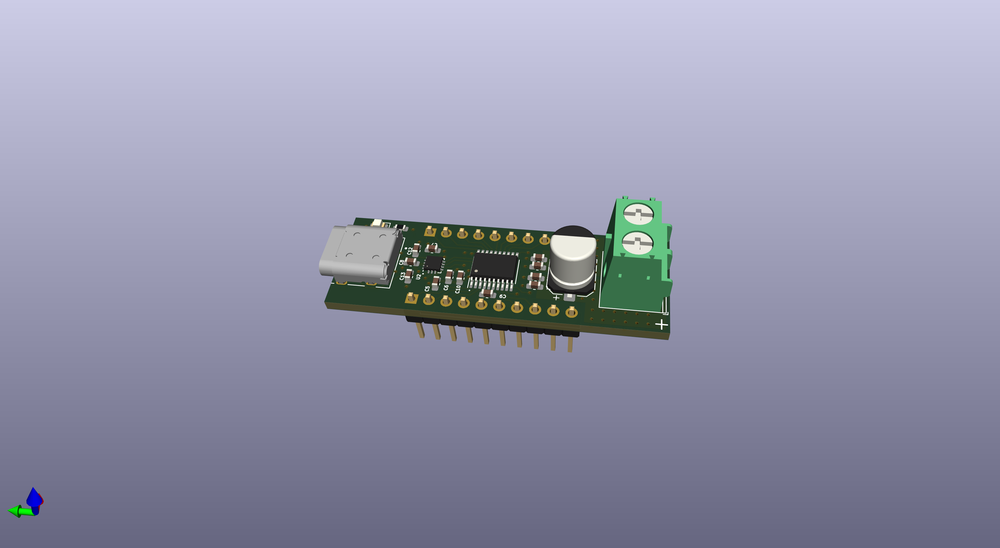

# PD_boi

This is a simple demo of the FUSB302 with STM32G030.
The device can negotiate an output voltage with a USB-C PD source.

The firmware is based on the [PD_micro](https://github.com/ryan-ma/PD_Micro) code, with the approproate changes to support the STM32.

